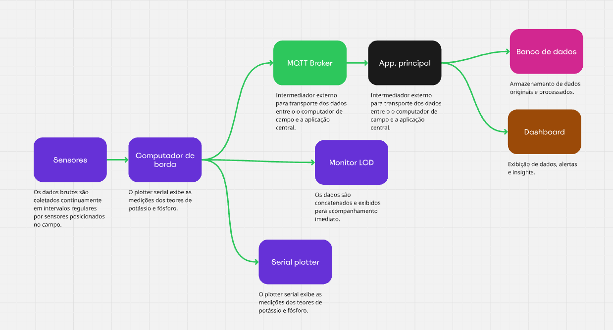
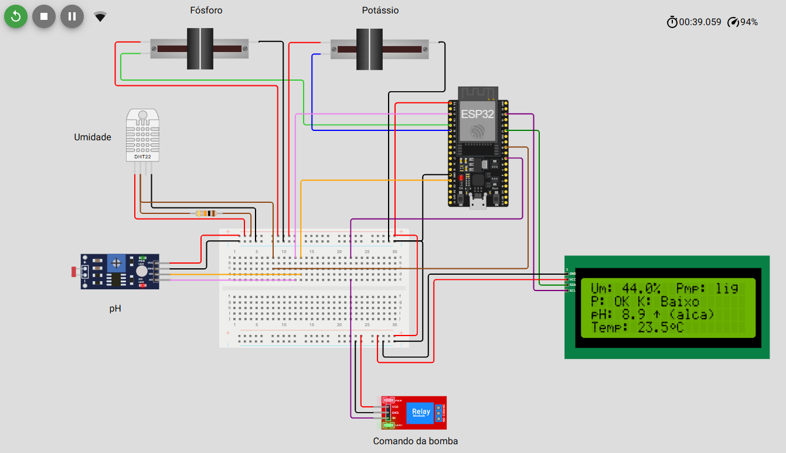
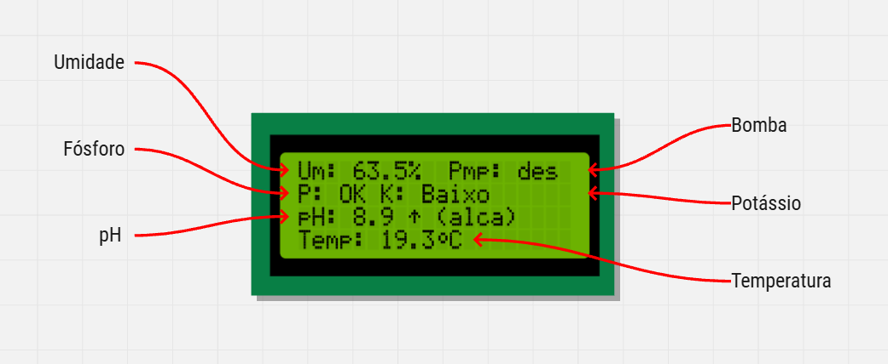
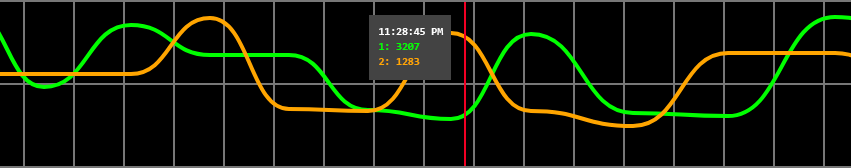
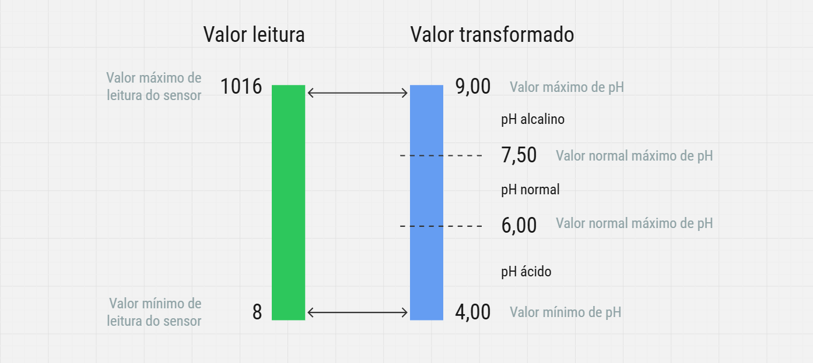

## FIAP - Faculdade de Informática e Administração Paulista

    

 

# Fase 4 - Automação e inteligência na FarmTech Solutions

## Grupo TiãoTech

    

## 👨‍🎓 Integrantes
- <a href="https://www.linkedin.com/in/edmilson-marciano-02648a33">RM565912 - Edmilson Marciano</a>
- <a href="https://www.linkedin.com/in/jayromazzi">RM565576 - Jayro Mazzi Junior</a>
- <a href="https://www.linkedin.com/in/lucas-a-5b7a70110">RM563353 - Lucas Arcanjo</a>
- <a href="https://www.linkedin.com/in/vinicius-andrade-01208822b">RM564544 - Marcus Vinicius de Andrades Silva Malaquias</a>

## 👩‍🏫 Professores

### Tutor
- <a href="https://www.linkedin.com/in/lucas-gomes-moreira-15a8452a">Lucas Gomes Moreira</a>

### Coordenador
- <a href="https://www.linkedin.com/in/andregodoichiovato">Andre Godoi Chiovato</a>

# Considerações iniciais e premissas

O presente projeto, no seu atual estágio tem por objetivo demonstrar o nosso domínio na aplicação prática dos conhecimentos adquiridos ao longo do curso. Assim, da maneira que entendemos, esta entrega focaliza principalmente o fluxo de dados, desde a coleta nos sensores simulados, até a apresentação de insights em um dashboard.
Para isso, optamos por enfatizar a prova de conceito em questão. Foi necessário que assumíssemos a premissa de que seria necessário, neste momento, abrir mão da fidelidade das predições e do valor efetivamente entregue pela solução, considerando a validade limitada dos dados disponíveis.

# Pipeline de dados

*
Fluxo de aquisição e processamento dos dados.
*

# Computador de borda

O kit foi modificado com relação à entrega anterior, para facilitar a interação com os controles durante a simulação. 

*
Composição modificada do kit de cmputador de borda e sensores.
*

As principais alterações foram:

- **Substituição dos dois pushbuttons** - Para de controle do teor de potássio e de fósforo por dois potenciômetros lineares, que fornecem leituras analógicas.

- **Substituição do monitor serial por um display LCD** - A formatação das mensagens e a definição de caracteres customizados permitiram acomodá-las todas no LCD, como mostra a figura a seguir.

*
Layout para exibição de dados no LCD.
*

- **Uso do serial plotter** - Para acompanhamento instantâneo da variação, no nosso caso, dos teores de potássio e fósforo no solo. Veja exemplo na figura a seguir.

*
Exemplo do uso do serial plotter capturado durante a simulação.
*

- **Mapeamento das escalas de leitura** - Transformação dos valores brutos apresentados pela leitura dos sensores em valores "palatáveis", semelhantes aos valores reais de cada uma das grandezas envolvidas, conforme mostra a figura a seguir.

*
Mapeamento de valores do sensor LDR para valores de pH da vida real.
*

- **Refatoração de dados de CSV para JSON** - O uso da biblioteca adequada ajuda a otimizar o uso de memória utilizada anteriormente na concatenação de strings para formatar o CSV.

## Simulação

A simulação foi realizada no Wokwi. O projeto do circuito pode ser acessado em https://wokwi.com/projects/433845529165572097.
Os arquivos relacionados encontram-se também em [sprint_2/documents/computer_7_diagram](sprint_2/documents/computer_7_diagram).

# Aplicação principal

O papel da aplicação principal é buscar no broker MQTT os dados enviados pelos sensores e submetê-los ao modelo de ML da aplicação, para emitir recomendações relacionadas ao acionamento, ou não, do mecanismo de irrigação.

## Dados

Utilizamos um dataset simulado com dados meteorológicos históricos, via CSV, para treinamento do modelo. Os dados obtidos dos sensores, via MQTT foram utilizados para a emissão das recomendações pelo modelo.

## Modelo de ML

### Escolha do modelo
Considerando que nosso problema definne-se em acionar ou não a irrigação, temos então um problema clássico de classificação binária, o qual se adequa perfeitamente ao uso do modelo  
DecisionTreeClassifier. Além disso, ele favorece a interpretabilidade do racional utilizado para suas predições.

### Treinamento do modelo
O treinamento foi realizado utilizando-se o modelo 80-20, mesclando os dados de CSV e MQTT para uma

### Insight
A cada leitura recebida, juntam-se as últimas 5 leituras mais recentes e o conjunto é submetido ao modeo treinado que amite um parecer se se deve acionar ou não a irrigação e qual o melhor período.

### Armazenamento em banco de dados
As leituras recebidas via MQTT são devidamente armazenadas na base de dados.

# Dashboard

## 📁 Estrutura de pastas

- sprint_2/**assets**: imagens e outros artefatos.

- sprint_2/**documents**: artefatos de simulação (/computer_7_diagram).

- sprint_2/**scripts**: scripts SQL para construção e população inicial do banco de dados.

- sprint_2/**src**: Todo o código fonte criado para o desenvolvimento do projeto ao longo das 7 fases.

- sprint_2/**README_sprint_2.md**: descrição geral do projeto (este documento que você está lendo agora).

## 📋 Licença

<a property="dct:title" rel="cc:attributionURL" href="https://github.com/agodoi/template">MODELO GIT FIAP</a> por <a rel="cc:attributionURL dct:creator" property="cc:attributionName" href="https://fiap.com.br">Fiap</a> está licenciado sobre <a href="http://creativecommons.org/licenses/by/4.0/?ref=chooser-v1" target="_blank" rel="license noopener noreferrer" style="display:inline-block;">Attribution 4.0 International</a>.

