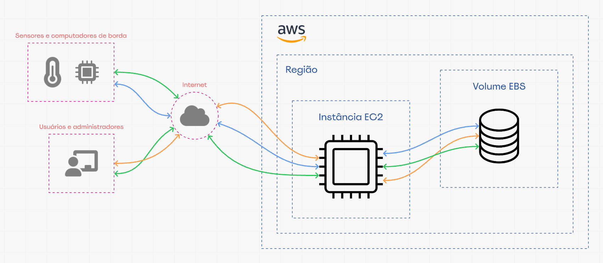

## FIAP - Faculdade de Informática e Administração Paulista

<p style="padding-top: 40px">
    <a href= "https://www.fiap.com.br/">
        
    </a>
</p>

<br>

# Sprint 3 - Fase 5 - FarmTech na era da Cloud Computing


## Grupo TiãoTech

<p style="padding-top: 10px;">
    
</p>


## 👨‍🎓 Integrantes
- <a href="https://www.linkedin.com/in/edmilson-marciano-02648a33">RM565912 - Edmilson Marciano</a>
- <a href="https://www.linkedin.com/in/jayromazzi">RM565576 - Jayro Mazzi Junior</a>
- <a href="https://www.linkedin.com/in/lucas-a-5b7a70110">RM563353 - Lucas Arcanjo</a>
- <a href="https://www.linkedin.com/in/vinicius-andrade-01208822b">RM564544 - Marcus Vinicius de Andrades Silva Malaquias</a>

## 👩‍🏫 Professores

### Tutor
- <a href="https://www.linkedin.com/in/lucas-gomes-moreira-15a8452a">Lucas Gomes Moreira</a>

### Coordenador
- <a href="https://www.linkedin.com/in/andregodoichiovato">Andre Godoi Chiovato</a>


# Entrega 1

Esta entrega prevê a análise de dados ([crop_yield.csv](input_data/crop_yield.csv)) relativos às condições do solo e a temperatura de uma fazenda e a previsão do rendimento da safra e explorar a tendência de produtividade.
Conforme solicitado, todos os comentários acerca do enunciado encontram-se no notebook da aplicação ([FarmTech_sprint_3.ipynb](src/FarmTech_sprint_3.ipynb)).


# Entrega 2

## Objetivo

Exercitar o uso da AWS Pricing Calculator, recurso que auxilia em estimativas prévias de custo mensal de uso das ferramentas de Cloud Computing da AWS.

## Configuração solicitada

- Função: hospedar API de coleta de dados de sensores agrícolas (entrega 1)
- Sistema operacional: Linux
- CPUs: 2
- Memória: 1 GiB
- Rede: até 5 Gb/s
- Armazenamento: 50 GB
- Região: a mais barata entre São Paulo (BR) e Virgínia do Norte (EUA)

**Outros requisitos e limitações**

    1 - Baixa latência no acesso aos dados.
    2 - Há restrições legais de acesso a dados no exterior.

**Importante**

- Dada a natureza do exercício, não foram consideradas necessidades outras que não as especificadas no enunciado.
- Assumimos que a anotação (HD) no enunciado não se refere necessariamente a um HD físico e sim apenas uma observação de que não se trata de um serviço de storage apartado.


## Serviços e cenários avaliados

Ao pesquisar sobre as características dos serviços de computação disponíveis na AWS e que se relacionem com o nosso contexto de uso, detivemo-nos em dois tipos de serviço:
> - **AWS Lambda** - Serviço de computação "sem servidor" (serverless). Não gerenciamos o servidor, apenas enviamos o código (no nosso caso, uma API), e o Lambda o executa em resposta a um evento. Ele lida automaticamente com a infraestrutura necessária para rodar seu código e escala para atender a qualquer volume de tráfego. Paga-se pelo tempo que o código está efetivamente rodando.
> - **Amazon EC2 (Elastic Compute Cloud)** - Serviço de computação que oferece servidores virtuais (instâncias) em nuvem. Oferece controle total sobre o sistema operacional e o software que instala. O EC2 é a base para hospedar a maioria das aplicações, sites e bancos de dados que precisam de um ambiente de servidor dedicado e com alta flexibilidade. Paga-se por hora de alocação da máquina.

Essas diferenças na própria concepção do serviço implicam várias diferenças, que acabam por interferir diretamente na configuração técnica e nos custos de contratação de um e de outro.

### Visão conceitual da arquitetura
<br>


*<center><sub>Cenários de arquitetura - Visão geral simplificada</sub></center>*

### Visão comparativa

Como base para nossa tomada de decisão, organizamos alguns aspectos mais importantes para o nosso contexto:

| Fator de decisão | AWS Lambda | Amazon EC2 | 
| --- | --- | --- |
| Modelo de Preço | Paga-se por execução do seu código, em milissegundos, com custo adicional por requisição.| Paga-se pela instância ligada, por hora ou segundo, independentemente de estar sendo usada ou não. |
| Escalabilidade | A escala é totalmente automática, gerenciando as variações nos volumes de requisição, sem intervenção. | Exige configuração manual ou uso de serviços de auto-scaling para escalar. |
| Gerenciamento de infraestrutura | É *serverless*. A AWS cuida de toda a infraestrutura necessária. | Deve-se gerenciar 'manualmente' a manutenção do sistema operacional, segurança, patches, etc. |
| Tipo de Carga de Trabalho | Ideal para tarefas orientadas a eventos, como o processamento de dados de sensores. |  Ideal para aplicações contínuas, que precisam estar sempre ativas, como um servidor web ou uma base de dados. |
| Flexibilidade e Controle | Possui restrições de ambiente e tempo de execução, mas em troca oferece simplicidade e gerenciamento. | Oferece controle total sobre o sistema operacional e a instalação de software, sendo mais flexível. |

### Conclusão

A comparação deixa claro que o serviço **AWS Lambda** se mostra muito mais vantajoso para o nosso caso e poderemos constatar essa afirmação na apresentação dos custos. Por outro lado, **em nome exclusivamente da prática e do aprendizado**, decidimos **ir além** e apresentar as estimativas de ambos os cenários.

## Estimativas realizadas na AWS Pricing Calculator
https://calculator.aws/

> Note que, pela mera ordem cronológica de confecção das estimativas, a sua numeração não segue a mesma ordem da estrutura deste documento. Assim, temos:
> - Cenário 1 - AWS Lambda - estaimativas 5 e 6
> - Cenário 2 - Amazin EC2 - estimativas 1 a 4

# Cenário 1 - AWS Lambda

### Critérios de seleção

Conforme solicitado, o critério principal é **preço**, ou seja, a configuração de menor custo, que atenda à especificação solicitada.

Foram feitas duas estimativas, uma para cada região solicitada.

### Configuração do Lambda

A infraestrutura disponibilizada pelo serviço AWS Lambda é gerenciada pela própria AWS, adaptando-se dinâmica e elasticamente às necessidades de consumo da aplicação (ou função) hospedada. Assim, devemos fornecer os parêmetros iniciais de configuração, que viabilizarão a escalabilidade da operação.

> - Arquitetura: x86
> - Volume de requisições: 6 req./h
> - Duração de cada requisição: 100ms
> - Memória alocada: 1 GB

#### Armazenamento

O modelo AWS Lambda inclui um chamado armazenamento `efêmero` de até 10 GB, cobrados separadamente. Ainda assim, não atendem ao nosso requisito inicial de 50 GB, o que implica a necessidade da contratação de um serviço de storage à parte.

Optamos pelo serviço Amazon S3 (Simple Storage Service), um serviço de armazenamento de objetos altamente escalável e de baixo custo, que se integra de forma nativa e eficiente com o Lambda e atende perfeitamente às nossas necessidades.

Utilizamos as seguintes configurações <sup>1</sup>:

> - Tamanho: 50 GB
> - Número mensal de requisições PUT, COPY, POST ou LIST: 4500 req/mês
> - Número mensal de requisições GET, SELECT e todas as outras: 100 req/mês
> - Tamanho médio do objeto: 2 KB

<sup>1</sup> - Note que os valores relacionados ao volume e duração das requisições, assim como o tamanho dos registros trafegados são meras estimativas e vão depender das caracaterísticas do projeto **em curso**.

### Estimativa 5 - AWS Lambda - Região US East (North Virginia)

Veja a estimativa no arquivo [agro-machine-estimate_us_east_op_5.pdf](documents/estimates/agro-machine-estimate_us_east_op_5.pdf) ou na [página da AWS](https://calculator.aws/#/estimate?id=54309418e610aee9684d434a00bef372cbed74ed "AWS Estimativa 5").

#### Resumo

| Serviço | Custo mensal (U$) |
| ----------- | -----------: |
| AWS Lambda - US East | 0,00 |
| Amazon S3 - US East | 1,17 |

- Os custos não incluem impostos

### Estimativa 6 - AWS Lambda - Região South America (São Paulo)

Veja a estimativa no arquivo [agro-machine-estimate_south_america_op_6.pdf](documents/estimates/agro-machine-estimate_south_america_op_6.pdf) ou na [página da AWS](https://calculator.aws/#/estimate?id=15c7f07c92c3a5d3aad8bc924f86c9aef4e894bf "AWS Estimativa 6").

#### Resumo

| Serviço | Custo mensal (U$) |
| ----------- | -----------: |
| AWS Lambda - US East | 0,00 |
| Amazon S3 - US East | 1,17 |

- Os custos não incluem impostos


# Cenário 2 - Amazon EC2

### Critérios de seleção

Conforme solicitado, o critério principal é **preço**, ou seja, a configuração de menor custo, que atenda à especificação solicitada.

Foram feitas duas estimativas, uma para cada região solicitada.

### Configuração selecionada

## Instância Amazon EC2 - t4g.micro
Trata-se de uma arquitetura de uso geral, recomendada para aplicações que não exigem desempenho extremo.

Utiliza armazenamento **AWS EBS** <sup>2</sup>

#### Características
- vCPUs: 2
- Memória: 1 GB
- Rede: até 5 Gb/s
- Armazenamento: **EBS** apenas <sup>2</sup>

#### Outras configurações
- Data transfer de entrada (internet): 5 GB/mês
- Data transfer de saída (internet): 5 GB/mês
- **Shared instances** - Opção de custo benefício mais favorável para esta fase. Compartilha o mesmo servidor com outras instâncias.
- **EC2 Instance Savings Plans** <sup>3</sup>

### <sup>2</sup> Amazon EBS Volume 
Um volume EBS, ou Elastic Block Storage, é um recurso lógico que atua como um HD ou SSD, mas pode estar distribuído ao longo de diversos discos e servidores em um data center, o que confere alta durabilidade e disponibilidade aos volumes.
- O volume EBS está localizado necessariamente no mesmo data center (availability zone) da instância EC2. Isso garante uma conexão de alta velocidade e baixa latência entre a instância e o armazenamento, já que eles estão fisicamente próximos.
- A persistência dos dados em um volume EBS independe do funcionamento da instância.
- É uma solução flexível e escalável.
- Backup (snapshots) configurável conforme a necessidade.

#### Características
- Tamanho: 50 GB

#### Outras opções
- General purpose SSD
- Backup diferencial, diário.
- Poderíamos optar por uma frequência menor de backup, o que baixaria o custo, mas com a contrapartida de tornar a operação menos segura.

### Opções de contratação

<sup>3</sup> **EC2 Instance Savings Plans** - Esta opção está disponível para contratação de uma família única de instâncias EC2 em uma única região - o que se aplica ao nosso caso -  e pode render descontos de até 72% nos valores de uso, mantendo a característica **on-demand** da instância contratada. A contrapartida é o tempo mínimo de contratação. Para fins de exercício, consideramos uma opção razoável, com um retorno de investimento favorável.

### Estimativa 1 - t4g.micro - Região US East (North Virginia)

Veja a estimativa no arquivo [agro-machine-estimate_us_east_op_1.pdf](documents/estimates/agro-machine-estimate_us_east_op_1.pdf) ou na [página da AWS](https://calculator.aws/#/estimate?id=9844a4d02d605a1469e255effbb8b9a71f9932b4 "AWS Estimativa 1").

#### Resumo

| Serviço | Custo mensal (U$) |
| ----------- | -----------: |
| Amazon EC2 - t4g.micro - US East | 11,08 |

- O custo do armazenamento EBS já está incluso.
- Os custos não incluem impostos
- Veja **Opções de contratação - EC2 Instance Savings Plans**, acima².

### Estimativa 2 - t4g.micro - Região South America (São Paulo)

Veja a estimativa no arquivo [agro-machine-estimate_south_america_op_2.pdf](documents/estimates/agro-machine-estimate_south_america_op_2.pdf) ou na [página da AWS](https://calculator.aws/#/estimate?id=7ee46ca7a4a522cb20b35ee179a43053655211d0 "AWS Estimativa 2").

#### Resumo

| Serviço | Custo mensal (U$) |
| ----------- | -----------: |
| Amazon EC2 - t4g.micro - South America | 18,01 |

- Observações idem estimativa 1, acima.

## Configuração alternativa

Ainda que o enunciado do exercício tenha sido claro, propomos aqui simular a possibilidade da seguinte situação imprevista:

1. Segundo os arquitetos da solução, a capacidade de memória de 1 GB pode ser limitante para o desempenho da API.
2. Uma análise das características da EC2 t4g levantou que a arquitetura utilizada nos processadores AWS Graviton2 (arquitetura ARM64), pode apresentar incompatibilidades com algumas biliotecas de Machine Learning para o Linux, exigindo atapas adicionais de compilação.

Diante disso, voltamos à calculadora.

### Configuração selecionada

## Instância Amazon EC2 - t3a.medium
Trata-se igualmente de uma arquitetura de uso geral.

#### Características
- **Memória: 4 GB**
- Todas as demais características, opções e observações são idênticas às apresentadas para a ```t4g.micro```.


### Estimativa 3 - t3a.medium - Região US East (North Virginia)

Veja a estimativa no arquivo [agro-machine-estimate_us_east_op_3.pdf](documents/estimates/agro-machine-estimate_us_east_op_3.pdf) ou na [página da AWS](https://calculator.aws/#/estimate?id=da24ed25632959a1fabd8b6e2131716925183795 "AWS Estimativa 3").

#### Resumo

| Serviço | Custo mensal (U$) |
| ----------- | -----------: |
| Amazon EC2 - t3a.medium - US East | 20,28 |


### Estimativa 4 - t3a.medium - Região South America (São Paulo)

Veja a estimativa no arquivo [agro-machine-estimate_south_america_op_4.pdf](documents/estimates/agro-machine-estimate_south_america_op_4.pdf) ou na [página da AWS](https://calculator.aws/#/estimate?id=df5725f307041bf1342e99a276b8d57b463396d0 "AWS Estimativa 4").

#### Resumo

| Serviço | Custo mensal (U$) |
| ----------- | -----------: |
| Amazon EC2 - t3a.medium - South America | 32,83 |

### Tomada de decisões
Elaborar a melhor estimativa para um projeto de arquitetura implica jogar com inúmeras variáveis de forma estratégica, já que pequenos ajustes podem resultar em economia ou gastos desnecessários. Para fins de exercício, foram elaboradas 6 estimativas, comparadas na tabela a seguir. 

Num caso real, o fine-tuning de parâmetros de configuração poderia exigir estimativas adicionais, dependendo das necessidades do projeto, reunindo informações que permitiriam decidir, de forma mais embasada, pela melhor opção, por parte dos stakeholders do projeto em questão.

A tabela a seguir resume algumas considerações sobre as opções estimadas.

#### Tabela comparativa final

| Estimativa | Instância / Região | Custo (U$/mês) | Vantagens | Desvantagens |
| :-------: | ------- | -------: | ------- | ------- |
| 1 | EC-2 t4g.micro - US East (North Virginia) | 11,08 | <ul><li>Menor preço EC2</li></ul> | <ul><li>Pode ter restrição de acesso a dados</li><li>Processadores com arquitetura ARM</li><li>Maior latência</li><li>Memória limitada</li></ul>
| 2 | EC-2 t4g.micro - South America (São Paulo) | 18,01 | <ul><li>Sem restrição de acesso a dados</li><li>Menor latência</li></ul> |<ul><li>Processadores com arquitetura ARM</li><li>Memória limitada</li></ul> 
| 3 | EC-2 t3a.medium - US East (North Virginia) | 20,28 | <ul><li>Arquitetura x86_64</li><li>Folga de memória</li></ul> | <ul><li>Pode ter restrição de acesso a dados</li><li>Maior latência</li></ul>
| 4 | EC-2 t3a.medium - South America (São Paulo) | 32,83 | <ul><li>Sem restrição de acesso a dados</li><li>Menor latência</li><li>Arquitetura x86_64</li><li>Folga de memória</li></ul> | <ul><li>Maior preço</li></ul>
| 5 | AWS Lambda - US East (North Virginia) | 1,17 | <ul><li>Menor preço geral</li><li>Arquitetura x86_64</li><li>Escalabilidade automática de infraestrutura</li></ul> | <ul><li>Pode ter restrição de acesso a dados</li><li>Maior latência</li></ul> |
| 6 | AWS Lambda - South America (São Paulo) | 1,17 | <ul><li>Menor preço geral</li><li>Arquitetura x86_64</li><li>Escalabilidade automática de infraestrutura</li><li>Sem restrição de acesso a dados</li><li>Menor latência</li></ul> |  |

As informações da tabela acima suscitam diversas questões a partir do confronto entre vantagens e desvantagens dessa ou daquela opção. Questões como:

> *O quão efetivamente vantajoso seria contratar um serviço mais barato e, em contrapartida, ter menos autonomia no controle do sistema operacional e do software instalado na instância contratada?*

> *Devemos pagar menos e arcar com o risco de sanções legais de acesso a dados em território estrangeiro e com uma maior latência no acesso aos dados?*

> *Devemos pagar mais e, em contrapartida, eliminar quaisquer riscos de incompatibilidade de bibliotecas de ML, além de menor latência de acesso aos dados?*

Vários outros questionamentos podem ser propostos e esse é o desafio para a visão estratégica dos profissionais envolvidos nessas decisões, dos quais se requer absoluto conhecimento do projeto em desenvolvimento.

### Fatores determinantes
O exercício permitiu observar, ainda que num nível ainda pouco aprofundado, como os valores estimados podem variar muito dependendo das opções configuradas. Dentre os principais fatores que influenciam o custo, podemos destacar:

#### Tipos de instância (tipo, geração e tamanho)
Este geralmente é o principal fator de custo. Exemplos: 
- O serviço `AWS Lambda` é mais indicados e oferece preços bem menores para projetos como o nosso, comparado com as instâncias `EC2`.
- Arquiteturas `t3` têm preço mais baixo que `t4`. 
- Gerações mais recentes, como `t3` e `t3`, tendem a ter um custo comparativamente menor e tecnologia superior.
- Uma arquitetura `micro` custa menos que uma `medium`, mas oferece menos recursos (vCPUs e memória).  

#### Região
Como mostra o próprio exercício, a localização física tem um impacto importante. Os preços de todos os serviços (EC2, EBS, transferência de dados) podem ser significativamente mais altos em uma região (como São Paulo) devido a custos operacionais e impostos locais.

#### Armazenamento
A arquitetura de armazenamento, o tipo e a capacidade provisionada também tendem a mudar sensivelmente os valores de uso. Embora o tipo EBS `gp3`, de uso geral, seja mais barato e flexível, soluções de altíssima performance, como `io2`, costumam ser bem mais custosos.
Já para o `Amazon S3`, há inúmeras outras modalidades de seviços disponíveis, dependendo do tipo de objeto a ser armazenado e das facilidades disponíveis.

#### Data transfer
A transferência de dados pode ser um custo estratégico, que não deve ser subestimado. Para economizar, seria ideal hospedar aplicações e bancos de dados na mesma região AWS. A transferência de dados entre serviços na mesma região geralmente é gratuita, enquanto a troca de dados com a Internet é cobrada. Essa diferença pode tornar os custos de transferência de dados significativamente mais altos se a arquitetura não for bem planejada.

## Conclusão

#### Sobre o uso da calculadora

Num primeiro momento, não proporciona uma experiência de uso agradável devido à complexidade da solução e do catálogo de serviços extenso e complexo. Há interfaces diferentes, dependendo do ponto de acesso. Há sobrecarga de informações e de opções. A navegação não é facilitada. A curva de aprendizado não é favorável. Fica claro entender por que é necessário ser um profissional certificado para lidar com projetos de computação em nuvem. Requer familiaridade e experiência com as opções e com a aplicação, assim como entendimento absoluto das necessidades do projeto para poder selecionar corretamente as opções mais adequadas e favoráveis.

Ainda assim, a calculadora conta com inúmeros recursos úteis, não só para o dimensionamento de estimativas, mas também para aprendizado do assunto e principalmente para tomada de decisões, como exemplos de cálculo, breakeven e memorial de cálculo detalhado das estimativas.

#### Decisão final

A conclusão final óbvia é de que, considerados os parâmetros e o contexto do nosso projeto, o serviço AWS Lambda é indiscutivelmente mais vantajoso, tanto em termos de preço (nosso principal critério neste estudo), quanto em termos das características técnicas. Tendo-se em conta ainda, que não há diferença de preço para essa modalidade, a contratação na região South America (São Paulo) é ainda mais favorável, já que oferece menor latência na transferência de dados, por estar geograficamente mais próxima e não impõe restrições de acesso a dados, por estar em território nacional.

> Sendo assim, a estimativa 6 seria a nossa opção final.


## 📁 Estrutura de pastas

- sprint_3/**assets**: imagens e outros artefatos.

- sprint_3/**documents**: documentos de estimativas AWS, entre outros.

- sprint_3/**README_sprint_3.md**: descrição geral da entrega (este documento que você está lendo agora).


## 📋 Licença

<p xmlns:cc="http://creativecommons.org/ns#" xmlns:dct="http://purl.org/dc/terms/"><a property="dct:title" rel="cc:attributionURL" href="https://github.com/agodoi/template">MODELO GIT FIAP</a> por <a rel="cc:attributionURL dct:creator" property="cc:attributionName" href="https://fiap.com.br">Fiap</a> está licenciado sobre <a href="http://creativecommons.org/licenses/by/4.0/?ref=chooser-v1" target="_blank" rel="license noopener noreferrer" style="display:inline-block;">Attribution 4.0 International</a>.</p>


